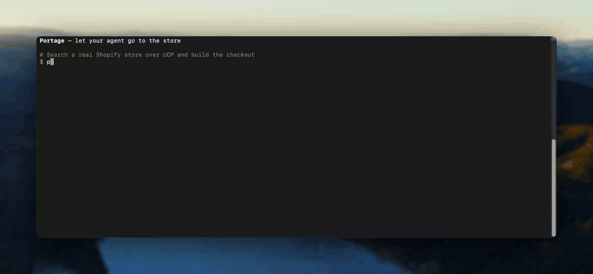

<h1 align="center">
  
</h1>

<p align="center">
  <a href="https://rubygems.org/gems/portage-cli"></a>
  <a href="https://rubygems.org/gems/portage-cli"></a>
  <a href="https://github.com/tomtom87/homebrew-portage"></a>
  
  
  <a href="https://portage.readthedocs.io/en/latest/"></a>
  <a href="#install-the-buy-plugin"></a>
  <a href="https://modelcontextprotocol.io"></a>
  <a href="https://ucp.dev"></a>
</p>

<p align="center">
  
</p>

Portage lets an AI agent find and buy things from real online stores for you, and you approve every payment. It ships as a command-line tool (`portage`), a Claude Code plugin (`buy`) that drives it, and Ruby gems that let any store serve the same open protocols ([MCP](https://modelcontextprotocol.io) and [UCP](https://ucp.dev)) to shopping agents. It is for people who want an agent to shop for them, developers building shopping agents, and merchants who want agents to buy from their store.

> **Status:** pre-1.0. APIs may still change between minor versions. Latest release set: 0.11.0 ([changelog](CHANGELOG.md)).

## Quickstart

Two ways in: let Claude shop for you with the `buy` plugin, or run the `portage` CLI yourself. Both use the same CLI and take about five minutes.

### Install the `buy` plugin

<!-- buy-plugin-install-start -->
The plugin teaches Claude Code to shop through the `portage` CLI, so install the CLI first.

1. **Install the CLI** (`portage-cli` 0.9.0 or newer):

    ```bash
    brew install tomtom87/portage/portage
    ```

    Or, on Ruby 3.2 or newer, `gem install portage-cli`. Homebrew bundles every adapter. With RubyGems, also install `portage-ucp-webmcp` 0.2.0 or newer if you want the Portage browser profile and checkout autofill.

2. **Add the plugin.** Inside Claude Code:

    ```text
    /plugin marketplace add tomtom87/Portage
    /plugin install buy@portage
    ```

    Or from a shell:

    ```bash
    claude plugin marketplace add tomtom87/Portage
    claude plugin install buy@portage
    ```

3. **Run `portage setup` once, in a terminal.** It asks for your shipping address, optional search keys and spending caps, one skippable step at a time. It is interactive, so run it yourself rather than through Claude.

4. **Ask Claude.** Type `/buy a burton snowboard under $600`, or just ask in plain words. The skill is listed as `buy:buy`. Claude checks your setup, shows real offers and a dry-run total, and waits for your yes before any purchase.

To update or remove it:

```bash
claude plugin marketplace update portage
claude plugin update buy@portage        # then restart Claude Code

claude plugin uninstall buy@portage
claude plugin marketplace remove portage
```

A listing in the Claude plugin directory is coming. Until then, this marketplace is the install route.
<!-- buy-plugin-install-end -->

### Other agents: Codex, Cursor, OpenCode and more

<!-- other-agents-start -->
The `buy` skill is a plain [`SKILL.md`](https://github.com/tomtom87/Portage/blob/main/plugins/buy/skills/buy/SKILL.md) file, so any agent that loads skills and can run commands on your machine can use it. Install the CLI and run `portage setup` first, as above.

- **With [dotagents](https://github.com/getsentry/dotagents)** (Codex, Cursor, OpenCode): one command installs the plugin into `~/.agents/` and generates each agent's plugin or skill files.

    ```bash
    npx @sentry/dotagents add tomtom87/Portage
    ```

    Refresh it with `npx @sentry/dotagents install`. Remove it with `npx @sentry/dotagents remove buy`. If your `agents.toml` only allows trusted sources, run `npx @sentry/dotagents trust add tomtom87/Portage` first.

- **As a plain skill** (VS Code, or any agent without plugin support): copy the [`plugins/buy/skills/buy/`](https://github.com/tomtom87/Portage/tree/main/plugins/buy/skills/buy) folder, `references/` included, into the agent's skills directory. With dotagents, declare it in `~/.agents/agents.toml` and run `npx @sentry/dotagents install` to get it in `~/.agents/skills/buy`:

    ```toml
    [[skills]]
    name = "buy"
    source = "tomtom87/Portage"
    path = "plugins/buy/skills/buy"
    ```

- **Chat apps in a browser** (ChatGPT, Grok and similar) can't run `portage` on your machine, so they can't use the skill. Use the vendor's coding agent or CLI instead, if it loads skills.
<!-- other-agents-end -->

### Use the CLI yourself

Install the CLI as in step 1 above, run `portage setup`, then:

```bash
portage find --query "burton snowboards" --json
portage buy "burton snowboards" --max-price 600 --dry-run --json
```

`find` works with no keys. Its default search, DuckDuckGo's keyless API, resolves brand and store names ("burton snowboards") but not open-ended queries ("waterproof hiking boots"). For those, add a Brave or Google search key: `portage setup` asks, and [search backends](portage-cli/README.md#search-backends) has the details. `buy` without a store URL lists offers and, in a terminal, lets you pick one. `--dry-run` shows the real total and never charges.

With a store URL, `buy` goes straight to that store's `/.well-known/ucp` manifest:

```bash
portage buy https://some-ucp-store.example --query "hoodie" --dry-run --json
```

To buy for real, enroll a payment method (`portage payment enroll <store-url>`), set spending caps (`portage policy set`), then drop `--dry-run` and add `--yes`. `buy` checks out only through a store's published UCP endpoint, or a platform API you already hold credentials for (your own store). Everything else ends in a hand-off. It never scrapes. The [CLI tutorial](docs/cli-usage-tutorial.md) walks through all of this, including what to do when search comes back empty.

`portage setup` saves to `~/.portage/.env` (chmod 600), and [`.env.example`](.env.example) lists every variable. Only `~/.portage/.env` loads automatically, never a `.env` in the current directory, so a cloned repo can't quietly redirect your purchases or traffic ([why](portage-cli/README.md#why-env-is-never-loaded-automatically)). Upgrading, two installs on one `PATH`, and the Linux keychain: [installation](portage-cli/README.md#installation).

## How a purchase finishes

Most stores don't let a third party complete payment, so `buy` usually builds the cart and hands off to you:

| Tier | What happens | Default |
|---|---|---|
| A | Opens the checkout in your own browser. You pay. | On |
| B | A separate Portage browser profile builds the cart, then stops at payment. You pay. | Off (opt in) |
| C | Hand-off only. Portage opens the page and you buy it yourself. No requests to the site, no scraping, no automation of any kind. | Every Amazon site, plus walmart.com, ebay.com, bestbuy.com and any host you add |

Amazon and similar retailers restrict automated purchasing agents in their terms, so Portage never automates them. The Amazon entries are on by default and yours to edit; walmart.com, ebay.com and bestbuy.com are always hand-off only. Details: [tiers](portage-cli/README.md#tiers-how-a-purchase-actually-finishes) and [hand-off targets](portage-cli/README.md#hand-off-targets-and-hand-off-only-hosts).

## Safety

These rules hold in every tier, for the CLI and the plugin:

- **No raw card data.** Card data never passes through Portage. Payment methods are tokens from `portage payment enroll`, kept in your OS keychain, and the plugin refuses anything that looks like a card number.
- **You approve every payment.** Nothing is bought without your explicit yes. A search result is never bought on `--yes` alone: you name the store. The plugin shows you the offers to pick from and the exact total to approve, each with a link to the product page, and one yes covers one purchase. `portage policy set --require-approval person` makes only a yes you type in your own terminal count. In a browser hand-off, you click pay.
- **Your browser's secrets stay closed.** Portage never reads your browser's password, cookie or autofill stores, and never attaches to your default browser profile.
- **No CAPTCHA or bot-wall bypass.** Portage reports it and hands off.
- **Spending caps.** `portage policy set` adds per-transaction, rolling and velocity caps and a store allowlist.

Portage is open-source software provided as-is, without warranty of any kind ([MIT](LICENSE)). How you use it on any site, and compliance with that site's terms, is your responsibility. Report security issues as described in [`SECURITY.md`](SECURITY.md).

## Commands

`portage --help` prints this. Flags and env vars for each command are in [`portage-cli/README.md`](portage-cli/README.md), also published as the [CLI reference](https://portage.readthedocs.io/en/latest/cli-reference/).

```text
usage: portage buy <url> --query "..." [--qty N] [--payment-token TOKEN]
                          [--product-id ID] [--yes] [--dry-run]
                          [--auto-open|--no-auto-open] [--notify-webhook URL]
                          [--handoff-target default|print|profile|agent:NAME]
                          [--decision-backend jev|laya] [--min-confidence N] [--json]
                          [--wait [--wait-timeout DURATION|off]]
       portage buy --offer REF [--qty N] [--yes] [--dry-run] ...
       portage buy --quote QUOTE_ID --yes [--json] ...
       portage buy --query "..." [--store URL] [--max-price N] [--limit N] ...
       portage find --query "..." [--max-price N] [--limit N] [--json]
       portage compare <url> --product-id ID [--id VALUE ...] [--results N]
                              [--max-price N] [--json]
       portage pick [--search LAST|SEARCH_ID] [--via auto|tty|agent] [--json]
                    [--choose REF | --compare REF | --view REF]
       portage approve QUOTE_ID [--via auto|tty|agent] [--relayed-yes | --view] [--json]
       portage history [list] [--purchases|--searches] [--limit N] [--json]
       portage history clear [--purchases|--searches]
       portage payment list [--json]
       portage payment enroll <url> [--label NAME] [--json]
                              [--scope-merchant HOST ...] [--scope-max-amount N] [--scope-currency CUR]
       portage payment set-default <id>
       portage payment remove <id>
       portage payment freeze <id>
       portage payment revoke <id>
       portage policy show [--json]
       portage policy set [--per-transaction-cap N --currency CUR]
                           [--rolling-cap N --rolling-window-seconds N --currency CUR]
                           [--velocity-count N --velocity-window-seconds N]
                           [--allow HOST ...] [--clear-allowlist]
                           [--require-approval person|any|off]  (lowering asks at a terminal)
       portage orders reconcile [--checkout ID] [--json]
       portage index build [--sources a,b] [--queries FILE] [--dry-run] [--export DIR] [--json]
       portage index refresh [--sources a,b] [--queries FILE] [--dry-run] [--export DIR] [--json]
       portage index show [--stores|--products] [--json]
       portage index add <url> [--json]
       portage index remove <host> [--json]
       portage index sources [--json]
       portage browser import [--browser chrome|edge|brave|arc|firefox|safari] [--profile-root DIR]
                              [--history-days 90] [--include-product-pages] [--max-probes 200]
                              [--exclude HOST,HOST] [--dry-run] [--yes] [--json]
       portage browser profile init|open|status [--browser chrome|edge|brave|arc] [--port N]
                              [--url URL (open only)] [--json]
       portage doctor [--require FILE] [--adapter CLASS_NAME] [--json]
       portage configure [--require FILE] [--adapter CLASS_NAME] [--json]  (alias for doctor)
       portage setup [--json]  (interactive wizard on a TTY; --json/no TTY: today's doctor report)
       portage generate adapter NAME [--dir DIR]
       portage generate agent-profile [--out FILE] [--key-out FILE] [--rotate]
       portage --version

     proxy flags (buy/find/compare/doctor/payment enroll):
       [--proxy URL] [--proxy-mode forward|gateway] [--proxy-header "Name: value"]
       [--no-proxy HOSTS] [--proxy-route ROUTE=URL|direct] [--proxy-chain URL,URL,...]
       [--proxy-passthrough HEADER] [--proxy-ca FILE] [--no-env-proxy]
```

## Packages and docs

| Package | Version | For | What it does | Docs |
|---|---|---|---|---|
| `buy` plugin | 0.7.1 | Shoppers | Claude Code plugin that shops through `portage` | [buy skill](docs/skills/buy.md) |
| [`portage-cli`](portage-cli/) | 0.9.0 | Shoppers | The `portage` command | [CLI reference](portage-cli/README.md), [tutorial](docs/cli-usage-tutorial.md) |
| [`shop-via-ucp`](skills/shop-via-ucp/SKILL.md) skill | – | Agent builders | Shop through a store's UCP endpoint, with or without `portage` | [skill page](docs/skills/shop-via-ucp.md) |
| [`portage-ucp-client`](portage-ucp-client/) | 0.6.3 | Agent builders | Ruby client: connect to a store's manifest, or drive your own `Adapter`, as the shopper's agent | [walkthrough](docs/walkthrough.md), [agent profile](docs/agent-profile.md), [tool gating](docs/ucp-tool-gating-investigation.md) |
| [`portage-ucp-decision`](portage-ucp-decision/) | 0.1.1 | Agent builders | Offer ranking, escalation policy, confidence gate (Jev/Laya), `PolicyGuard` | – |
| [`portage-ucp-journal`](portage-ucp-journal/) | 0.1.1 | Agent builders | Buyer-side purchase journal and its `Store` abstraction | – |
| [`portage-ucp-webmcp`](portage-ucp-webmcp/) | 0.2.0 | Both | WebMCP transport: serve tools in the page, or drive a page's tools (Tier B profile, autofill) | – |
| [`portage-ucp`](portage-ucp/) | 0.10.0 | Merchants | Protocol core: `Adapter` contract, capability registry, manifest builder, MCP server | [serving `/.well-known/ucp`](docs/well-known-ucp.md), [security hooks](docs/security-hooks.md), [library usage](docs/library-usage.md) |
| [`serve-via-ucp`](skills/serve-via-ucp/SKILL.md) skill | – | Merchants | Set up a store's own UCP endpoint | [skill page](docs/skills/serve-via-ucp.md) |
| [`portage-ucp-shopify`](portage-ucp-shopify/) | 0.5.1 | Merchants | Shopify Admin and Storefront GraphQL APIs | – |
| [`portage-ucp-wix`](portage-ucp-wix/) | 0.1.5 | Merchants | Wix Stores Catalog and eCommerce REST APIs | – |
| [`portage-ucp-woocommerce`](portage-ucp-woocommerce/) | 0.2.2 | Merchants | WooCommerce Admin REST API and Store API | – |
| [`portage-ucp-bigcommerce`](portage-ucp-bigcommerce/) | 0.1.5 | Merchants | BigCommerce v3 Catalog/Carts/Checkouts and v2 Orders APIs | – |
| [`portage-ucp-magento`](portage-ucp-magento/) | 0.1.5 | Merchants | Magento/Adobe Commerce REST v1 | – |
| [`portage-ucp-etsy`](portage-ucp-etsy/) | 0.1.5 | Merchants | Etsy Open API v3 catalog and orders; checkout is a redirect link | – |
| [`portage-ucp-instagram`](portage-ucp-instagram/) | 0.1.5 | Merchants | Meta Commerce Catalog; checkout is a redirect link; `get_order` is deprecated and stops working after Meta removes its Order Management endpoints on 2026-10-27 | – |

**Merchants:** an adapter gem, or your own `Adapter` subclass of `portage-ucp`, serves your catalog, cart and checkout over MCP and UCP. Each adapter gem ships an `exe/` server, an `examples/portage_ucp.rb` starting point and the `PORTAGE_UCP_CONFIG` hook ([library usage](docs/library-usage.md), [credentials](docs/adapter-requirements.md), [capability coverage](docs/capability-coverage.md)). On Shopify, the native Universal Commerce Agent app covers checkout and orders with no code; Portage adds `cart`, `catalog` and a signed manifest ([serving `/.well-known/ucp`](docs/well-known-ucp.md)).

**Contributors and adapter authors:** [architecture](docs/architecture.md) · [writing adapters](docs/writing-adapters.md) · [spec conformance](docs/spec-conformance.md) · [development](docs/development.md) · [`CONTRIBUTING.md`](CONTRIBUTING.md).

**AI agents reading the docs:** the docs site publishes [`llms.txt`](https://portage.readthedocs.io/en/latest/llms.txt) and `llms-full.txt`.

## Running behind a proxy

`buy`, `find`, `compare`, `doctor` and `payment enroll` take `--proxy*` flags. The same settings work as `PORTAGE_PROXY*` env vars or a `"proxy"` section in `~/.portage/config.json`. Anything left unconfigured falls back to the standard `HTTPS_PROXY`/`HTTP_PROXY`/`NO_PROXY` variables, except payment traffic, which goes direct unless you name a proxy for it. `portage doctor` shows the effective proxy for each route, with credentials redacted. Recipes for corporate egress, rotating pools, API gateways, mitmproxy and nginx/Cloudflare, plus the env-var caveats, are in [`docs/proxy.md`](docs/proxy.md).

## Requirements

Ruby 3.2 or newer, and the `mcp` gem `~> 0.24` (pulled in by `portage-ucp`). The Homebrew formula brings its own Ruby, so a Homebrew install needs neither.

## Contributing

Bug reports and pull requests are welcome at [tomtom87/Portage](https://github.com/tomtom87/Portage). The project is pre-1.0 and still tracking the spec, so open an issue before any change bigger than a bugfix. [`CONTRIBUTING.md`](CONTRIBUTING.md) has the workflow; the [Code of Conduct](CODE_OF_CONDUCT.md) applies.

## License

[MIT](LICENSE). Copyright (c) 2026 Tom Whitbread.
